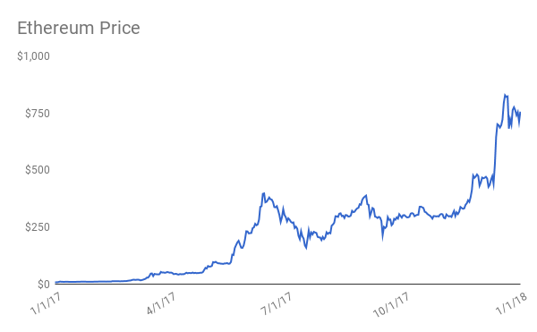

# Is Ethereum Undervalued?

I'm going to argue why Ethereum is undervalued relative to the current price of roughly $850. Let's first identify what gives Ethereum value—good way to identify Ethereum's utility value, as opposed to speculative value, is to fill in this blank: I need to buy ether in order to do X. For me, the clearest answer is to pay for gas (compute power) when making transactions in the Ethereum network.

Ethereum is a decentralized protocol that enables developers to build smart contracts, or dapps, and deploy them on the Ethereum Virtual Machine-similar to decentralized cloud computing. The platform requires users to pay transaction fees for gas in the network in the form of ether. So in contrast to other cryptocurrencies like Bitcoin whose value is derived primarily from utility as a currency, Ethereum's value is derived as decentralized infrastructure akin to cloud computing, fueled by ether which functions like a commodity in the network. While arguably narrower in scope, this is what I took as the basis for my valuation.

### Valuation Methods

Given the source of Ethereum's utility value, I attempted two methodologies for valuation. The first is a bottom up approach, using the insight that transaction fees in the Ethereum network are probably the closest equivalent to cash flows, and that the overall network value should be some multiple of these fees. The second is a top down approach looking at the size of the cloud services market and estimating what share Ethereum might capture in the future. For both methods, I took a 5-year time horizon, projected the network value in 2023, estimated the supply of Ethereum in 5 years based on the supply schedule and anticipated upgrades such as Casper, used this plus the velocity of ether to get a price in 2023, and discounted this price back to 2018.

While I've abstracted away a lot of the critical assumptions, I essentially ended up with a downside, base and upside case for each of the two methods. My bottom up results gave me a present value of $199, $972 and $1,746 for each case, respectively. My top down results gave me $175, $873 and $1,572 respectively. To view the valuation models I built in more detail see this [Google Sheet](https://docs.google.com/spreadsheets/d/15wO_KSItZhA_91ZtrWLdEmrRk7xDjympTJ05FLSjbxA/edit#gid=0).

These results suggest that in both downside scenarios Ethereum is currently overvalued, however in the base cases slightly undervalued (but quite close to current price), and in the upside clearly undervalued. The key assumption in each of these valuation models was essentially one of scale-the downside, base and upside cases fluctuted based on how scalable I assumed the technology would be.

### Scalability

At the moment the Ethereum network can only process around 20 transactions per second (for comparison VISA can do about 24k). I would argue that the single biggest limiting factor to wider adoption of Ethereum is scalability. A recent article claims we are "roughly 250x off being able to run a 10m user app and 25,000x off being able to run Facebook on chain". Until and unless Ethereum can scale, there will be no killer dapps that bring the technology mainstream. However, if it can scale, Ethereum could become the computing infrastructure for the next Google or Facebook, in addition to hundreds or thousands of other dapps built on top of the platform. Ultimately, one's optimism or pessimism regarding Ethereum's potential to scale is what I argue should drive the belief whether it is undervalued or overvalued today.

Personally, I'm optimistic because I believe Ethereum not only provides an excellent technology service and has positioned themself to be the winning smart contract platform for the future, but they have support from large organizations such as JPMorgan and Microsoft as part of the Enterprise Ethereum Alliance and even interest from a number of governments. They have an extremely strong and active development team (as a heuristic, Ethereum is well ahead of other cryptocurrencies in terms of total lines of code-currently around 1.1m), they have not had a crisis of leadership in the way Bitcoin has, and they have a strong community building exciting projects at both the application-level, like Augur and Golem, as well as on the protocol-level like 0x for decentralized exchanges, all of which will allow Ethereum to scale organically over time.

While Ethereum has many challenges that lay ahead in terms of scalability and governance, they have growth potential comparable to that of the Internet itself, and with the implementation of upgrades such as proof-of-stake, off-chain transaction networks and sharding, they have a roadmap for how to hopefully achieve it.

[Disclosure, I own some ETH]
